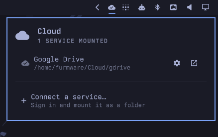

# Omarchy Cloud Plugin



Mount Google Drive, Dropbox, OneDrive and other cloud storage as ordinary
folders on Omarchy, with connection status in the bar.

Files appear in Nautilus like any other folder — open, edit, save, delete.
Behind the scenes it is [rclone](https://rclone.org/) mounted through FUSE and
supervised by systemd.

```
Bar widget  ──▶  systemd user units  ──▶  rclone mount  ──▶  ~/Cloud/<service>
  (status)         (supervision)           (transport)        (what you browse)
```

## Install

```bash
omarchy plugin add https://github.com/<you>/omarchy-cloud-plugin.git
omarchy plugin enable furmware.cloud
```

Plugins land disabled so you can read the code before running it — the
`enable` step is what puts the widget in your bar.

`rclone` itself is not installed by the plugin (Omarchy's plugin installer
never runs sudo). The panel offers to install it on first use, or:

```bash
omarchy pkg add rclone
```

## Connecting a service

Click the cloud icon in the bar, then **Connect a service…**. A terminal opens
and asks three questions: which provider, what to call the folder, and — for
Google Drive — whether to show Google Docs as Office files.

Signing in happens in your browser. When it finishes, the folder is mounted,
bookmarked in the Files sidebar, and set to mount again at every login.

## What it does to your system

Everything is user-level. Nothing here needs root, and nothing is written
outside your home directory.

| Path | What |
|------|------|
| `~/Cloud/<name>/` | Where each service is mounted |
| `~/.config/rclone/rclone.conf` | rclone's own config and credentials |
| `~/.config/omarchy-cloud/settings.conf` | Mount flags, read by systemd at login |
| `~/.config/omarchy-cloud/remotes/<name>.conf` | Per-service mount flags |
| `~/.config/systemd/user/rclone-mount@.service` | The generated mount unit |
| `~/.config/gtk-3.0/bookmarks` | One sidebar entry per connected service |
| `~/.cache/rclone/` | The file cache (size-capped, see settings) |

## Things worth knowing

**Deleting skips the desktop trash.** FUSE mounts have no trash directory, so
Nautilus deletes go straight to the provider. Google Drive and Dropbox keep
their own server-side trash, so files are usually recoverable there — but
Ctrl+Z will not bring them back.

**This is a mount, not a sync client.** Files live in the cloud; the local
cache is a convenience. Mounts stop when you log out. Recently opened files
stay readable offline while they are still in the cache (`full` cache mode),
but a file you have never opened is not on your disk.

**Google Docs open in the browser.** Docs, Sheets and Slides aren't real files
— Drive only stores them online, and their size is unknown until they're
converted. rclone's docs are blunt about the consequence: through a mount they
report 0 bytes, and *"you may not be able to download Google docs using rclone
mount."* There is no flag that fixes it.

So the default is to show each one as a small link file that opens the document
in Google Docs, Sheets or Slides, where it's editable. Two alternatives are
available per service under **Settings → Google Docs handling**:

| Choice | Result |
|--------|--------|
| Open in Google Docs (default) | Small `.link.html` files; double-click opens the browser |
| Convert to Office files | `.docx` / `.xlsx` / `.pptx` — often 0 bytes and unopenable |
| Hide them | Google-native files don't appear at all |

**The shared OAuth credentials are rate-limited.** rclone's built-in Google
client ID is shared by every rclone user, and throttles under load. For a
large Drive, create your own client ID and set it with
`rclone config update <name> client_id=... client_secret=...`.

## Per-service settings

Click the gear beside any connected service. Nothing chosen during setup is
permanent:

- **Google Docs handling** (Drive only) — the three options above
- **Mount at login** — on or off
- **Extra rclone flags** — anything from that backend's rclone page
- **Disconnect this service** — unmount, delete the saved sign-in, drop the
  bookmark. Nothing in the cloud is touched.

Changing mount flags restarts that one mount so the change takes effect.

## Plugin settings

Right-click the bar widget → Settings, or edit the entry in
`~/.config/omarchy/shell.json`.

| Setting | Default | Notes |
|---------|---------|-------|
| Mount folder | `~/Cloud` | Changing it requires remounting each service |
| File cache | `full` | `off` breaks saving in most editors — see below |
| Cache size limit | 8 GB | Least recently used files are evicted first |
| Status refresh | 15 s | Local only, cheap |
| Storage usage refresh | 20 min | One network call per mounted service |
| Show text in bar | off | Prints `mounted/total` next to the icon |

On the cache mode: with `off`, a file cannot be open for reading and writing
at the same time, which is exactly what applications do when they save. Use
`writes` at minimum; `full` additionally gives correct random access and
offline reads of cached files.

## Using it from the terminal

Every layer works on its own, which is also how you debug it.

```bash
omarchy-cloud-connect                     # the setup wizard
omarchy-cloud-configure gdrive            # per-service settings
omarchy-cloud-reconnect gdrive            # re-run sign-in

omarchy-cloud-mount status --with-quota   # what the panel sees, as JSON
omarchy-cloud-mount enable gdrive         # mount now and at login
omarchy-cloud-mount stop gdrive           # unmount for this session
omarchy-cloud-mount run gdrive            # exactly what systemd runs, in the foreground
omarchy-cloud-mount forget gdrive --yes   # disconnect and delete credentials

systemctl --user status rclone-mount@gdrive
journalctl --user -u rclone-mount@gdrive -f
```

`forget` deletes local credentials and the bookmark. It never touches
anything stored in the cloud.

## Not yet supported

**iCloud Drive.** rclone's iCloud backend exists but is classified
experimental: its trust token expires every 30 days and needs re-authenticating
by hand, app-specific passwords are rejected, and there are open upstream bugs
in the 2FA flow. Support is planned once the plugin can handle scheduled
re-authentication properly rather than presenting a monthly breakage as an
error. You can connect it today via **Something else** in the wizard
(backend name `iclouddrive`), with those caveats.

**Offline sync.** Only cached files work offline. A true offline folder needs
`rclone bisync` and a conflict-resolution story.

## Developing

Symlink the checkout into the plugin directory so edits apply in place:

```bash
ln -sfn ~/Projects/omarchy-cloud-plugin ~/.config/omarchy/plugins/furmware.cloud
omarchy-shell shell rescanPlugins
omarchy plugin enable furmware.cloud
```

QML files reload on `rescanPlugins`. **`Model.js` does not** — it is a
`.pragma library`, which the QML engine caches for the life of the process, so
changes to it need `omarchy restart shell`. Symptom: an edit that plainly
should have applied has no effect.

```bash
omarchy plugin validate .                 # manifest against the Omarchy schema
journalctl --user -f | grep -i qml        # QML load errors
```

## Requirements

Omarchy 4 (shell plugin system), `rclone`, `fuse3`, `python3`, `gum`. All but
rclone ship with Omarchy.

## License

MIT
